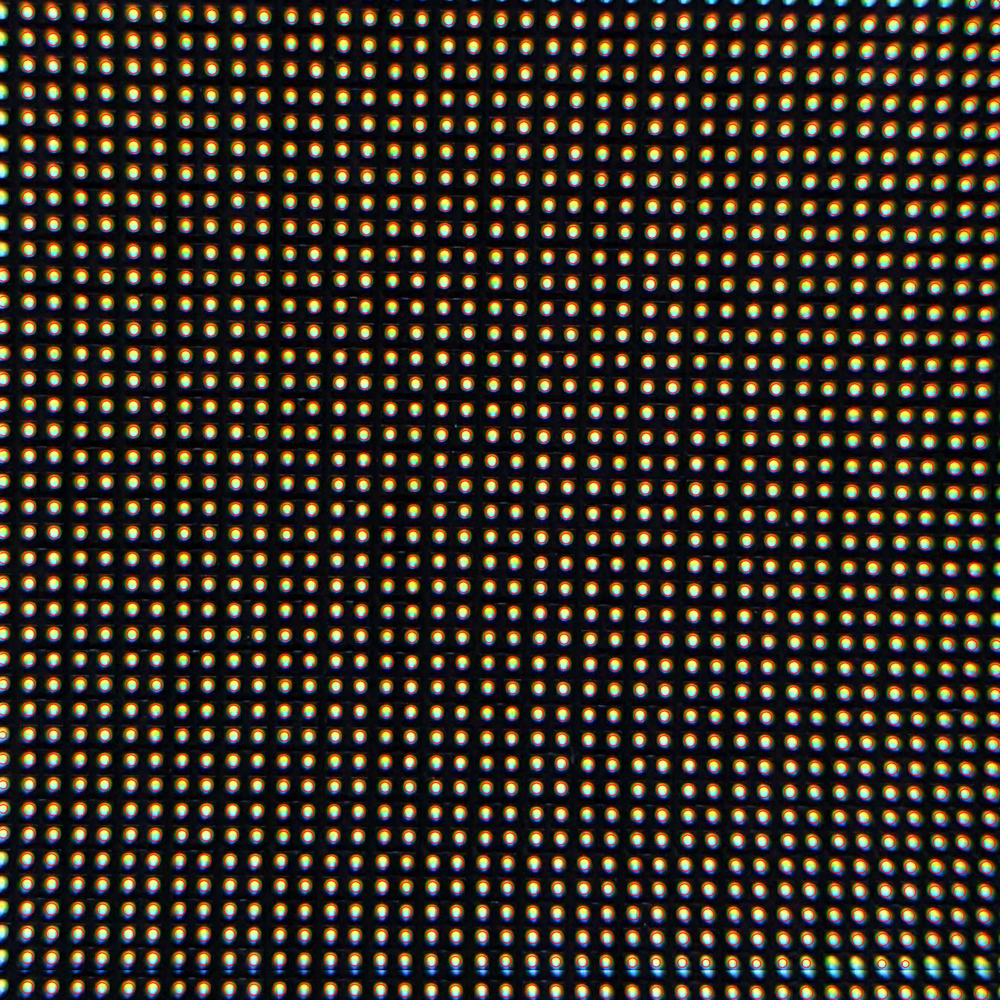
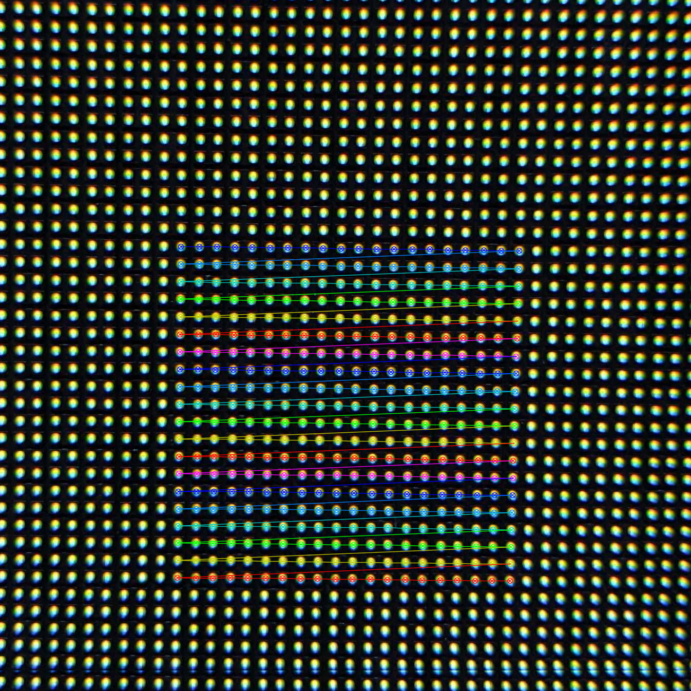
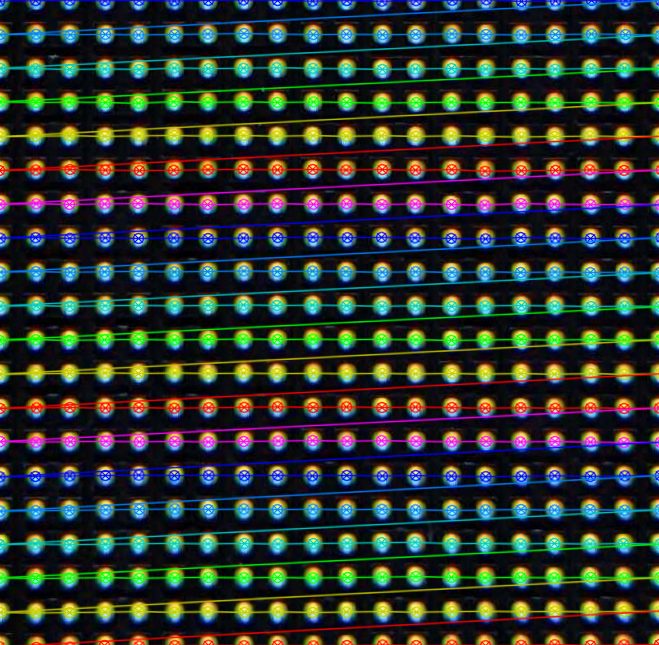
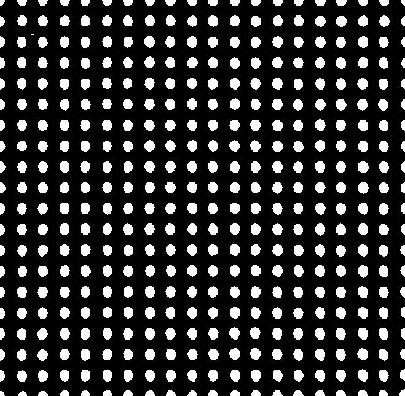

# surgical-seltzer
OpenCV LED display fill factor calculator

Note that panel and camera settings have a fairly significant effect on final
percentage calculation.
This panel captured on my phone measures out at 18.1% fill factor, whereas
captured via a full frame mirrorless with 45mm lens results in 12.4% fill
factor. Will have to experiment with luminance and camera settings to get a
repeatable and realistic amount of bloom out of each pixel.

## Keypoint detection

## Grid detection

## Grid warp correction

## Warped grid thresholding and area calculation
